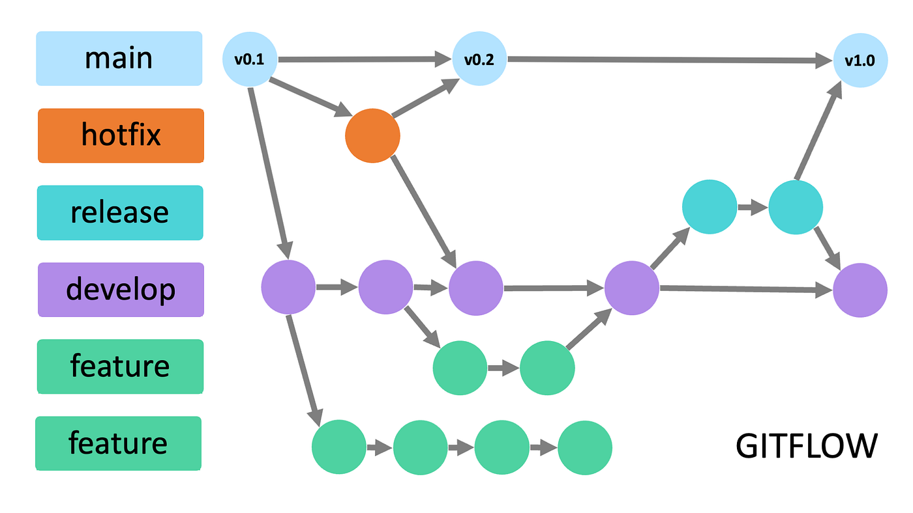

# Git flow

This guide explains branch naming conventions, commit message best practices

## Branch Naming Conventions

### Core Branches

| Branch      | Purpose            | Notes                             |
| ----------- | ------------------ | --------------------------------- |
| master/main | Production code    | Always deployable, protected      |
| develop     | Integration branch | Pre-production testing, protected |

### Supporting Branches

- Use lowercase with hyphens (e.g., feature/user-auth)
- Follow the format: type/short-description

#### Common branch types

- feature/ → New feature development (feature/payment-integration)
- bugfix/ → Fixing a bug (bugfix/login-error)
- hotfix/ → Urgent fix on production (hotfix/memory-leak)
- release/ → Preparing a release (release/v1.2.0)
- docs/ → Documentation changes (docs/update-readme)
- refactor/ → Code restructuring (refactor/db-layer)
- test/ → Adding or improving tests (test/api-endpoints)
- chore/ → Maintenance tasks (chore/ci-config)

## Writing Meaningful Commits

A well-written commit message improves project readability and collaboration.

- Start with a type: `feat`, `fix`, `docs`, `refactor`, `test`, `chore`, `perf`, `revert`, `build`, or `ci`
- Format: \<type>(optional scope): \<short-summary>

Examples:

- feat(auth): add JWT-based login system
- fix(cart): prevent crash on checkout
- docs: update contributing guidelines

Best practices:

- Use imperative verbs (“add”, “fix”, “update”)
- Keep the subject 50 characters or less
- Write a descriptive body if needed
- Make atomic commits (one logical change per commit)

## Git flow

