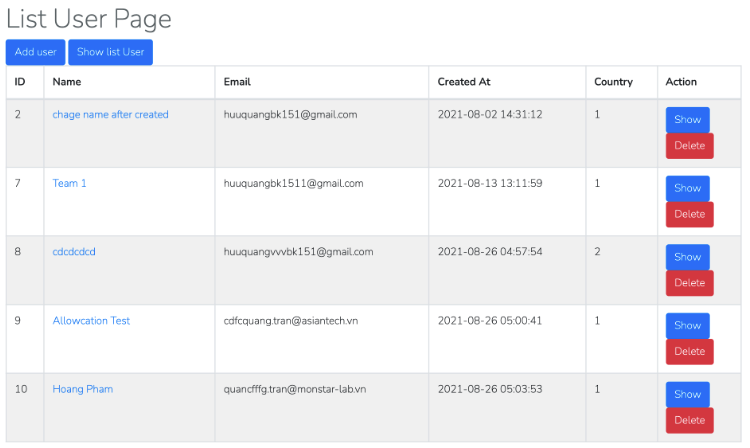

# Checkpoint 1

## Practice 1: Route - Controller - Model

1. Create the code base structure for ExpressJS

- Use `express-generator`
- Use Sequelize

2. Create the database (use Sequelize migrations and seeders) with the following tables:

- users
  + id (bigInteger),
  + name (string),
  + age (integer),
  + email (string),
  + password (string),
  + birthday (datetime),
  + status (integer)
- posts
  + id (bigInteger),
  + content (string),
  + user_id (unsignedBigInteger)
- comments
  + id (bigInteger),
  + content (string),
  + post_id (unsignedBigInteger),
  + user_id (unsignedBigInteger)
- profiles
  + id (bigInteger),
  + address (string),
  + tel (string),
  + user_id (unsignedBigInteger),
  + province (string)

3. Write the routes, controllers and functions for the following pages:

- Create the user list page (URL: /users) and the comment list page (URL: /comments)
- On the user list page, add a comments button to each row. Clicking it goes to the page listing all comments of that user (URL: /users/{id}/comments)
- On the user list page, add a show button to each row. Clicking it goes to the user detail page, showing all data of that user, including their profile, posts and comments (URL: /users/{id})
- On the comment list page, add a show user button to each row. Clicking it goes to the page showing the data of the user who wrote that comment (URL: /comments/{id}/user)
- On the user list page, clicking a user's name goes to the page listing all posts of that user (URL: /users/{id}/posts)
- Add a create user page (URL: /users/create). After the user has been created, redirect back to the user list page

Example UI

## Practice 2: Relationship

1. Define the relations between the models

- User - Post: One-to-Many
- User - Comment: One-to-Many
- Post - Comment: One-to-Many
- User - Profile: One-to-One

2. Redo question 3 of Practice 1 using the model relationships instead of manual queries
3. Update the user list page: add two columns showing each user's total number of posts and total number of comments. Clicking a total goes to the post list or the comment list of that user
4. Update the user list page: add a search feature that searches users by name
5. Update the user list page: add sorting and pagination

- Sort by name
- Sort by age
- Sort by total posts
- Sort by total comments

## Practice 3: API

- Create the APIs to create, update and delete a user
- Update the user list page:
  - Add an action column with 2 icons (edit, delete) in each row
  - Add a create button above the list
  - Clicking the edit icon opens the edit user modal. Submitting the modal calls the update user API; on success, refresh the user list data
  - Clicking the delete icon opens the delete modal, which contains a deletion confirmation message and OK/Cancel buttons. Clicking OK calls the delete user API; on success, refresh the user list data
  - Clicking the create button opens the create user modal. Submitting the modal calls the create user API; on success, refresh the user list data
