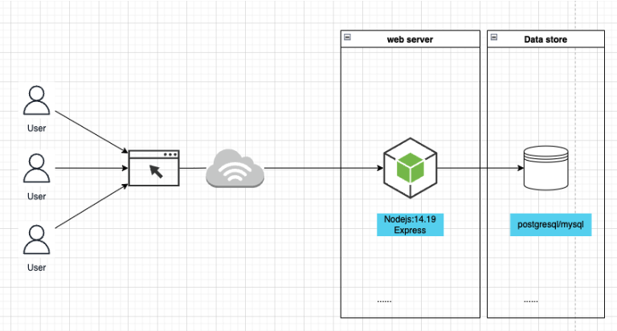

# Docker

## Knowledge

1. What is
- Docker image
- Docker container
- Docker layer

2. Describe commands
- docker logs \<container name>
- docker pull \<image name>
- docker push \<image name/repository>
- docker restart \<container name>
- docker rm \<container name>
- docker rmi \<container name>
- docker run
  - docker run \<image name>
  - docker run -name \<container name> \<image name>
  - docker run -d \<image name>
- docker start \<container name>
- docker stop \<container name>
- docker ps
- docker ps -a
- docker images
- docker exec \<container name> \<command>
- docker tag \<source image>:\<tag> \<dist image>:\<tag>

## Practice

Use Dockerfile and docker compose to build the system same as image
- Can access to localhost:3000 to go to home
- Web server can connect to database
- Hot reload with nodemon and docker bind mount

